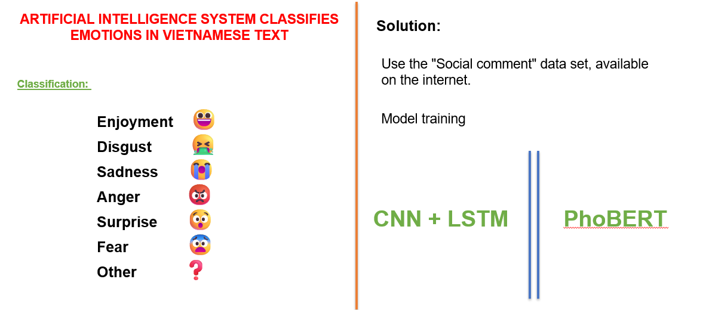
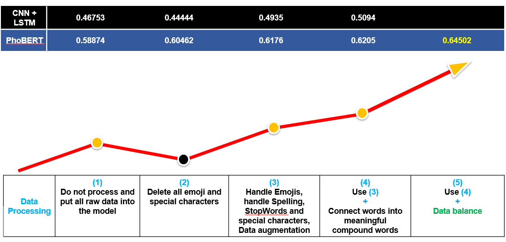
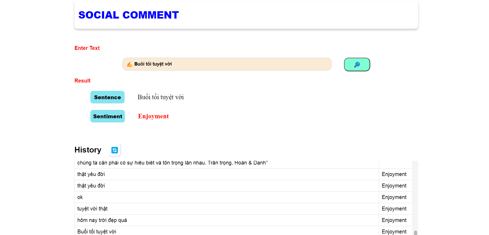
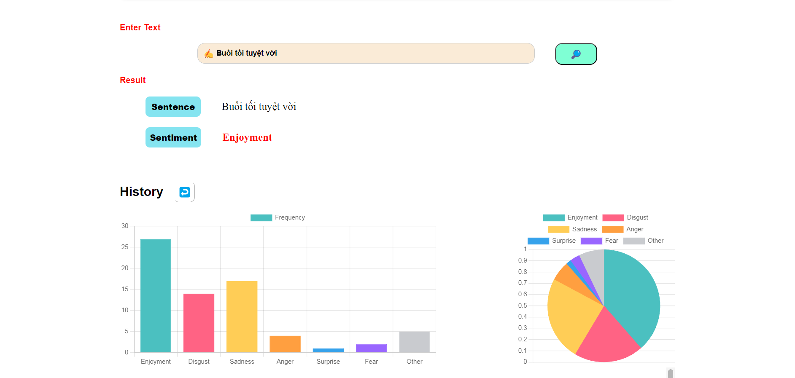

# **SentimentAnalysis **

18/09/2023 - 20/11/2023

## **The Team**

+ UI Specialist: Ha Khai Hoan (Leader)
+ Email: khaihoan.ai@gmail.com
+ GitHub: https://github.com/Hoanha2101

+ Data processing: Nguyen Minh Phat
+ Email: phatpy303s@gmail.com
+ GitHub: https://github.com/daicafa

+ Data processing: Bui Dinh Thanh Danh
+ Email: danhbui.171203@gmail.com
+ GitHub: https://github.com/thanhdanh17

Analyzing people’s opinions has never been an easy task due to their versatility and ambiguity.

<h1> “    What do people think about ‘X’?   ” </h1>

- There are many articles online, difficult to control.
- Through comments and reviews, posts on social networks can be controlled automatically. 
- Control comments

Moreover, female comments are especially difficult for Vietnamese
It is for these reasons that we decided to build an artificial intelligence system that analyzes sentiment on social network comments.

We have conducted training and built the system in parallel with the two current SOTA models, with the aim of verifying that our implementation is completely correct to improve the model's prediction performance.

## Results

After many times of data processing, the results show that the PhoBert model is learning better, so we have integrated it into our server.

## Website

In addition to the interaction with the test bar, we have added a bar and pie chart update system to monitor the quality of all comments.

